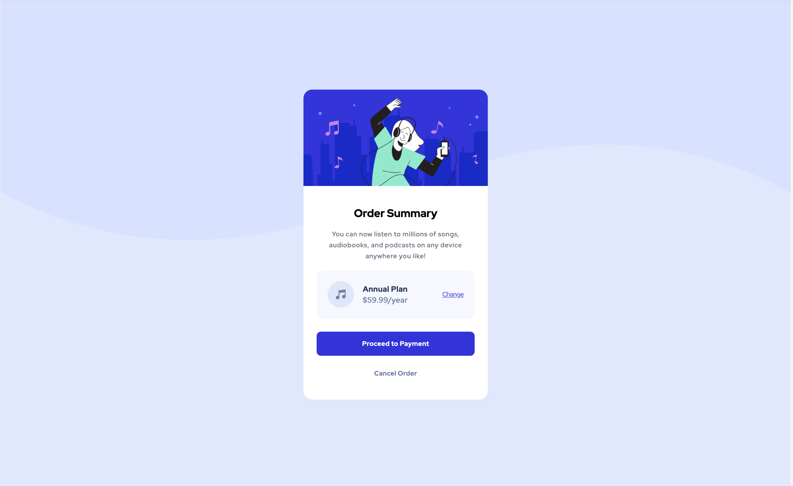
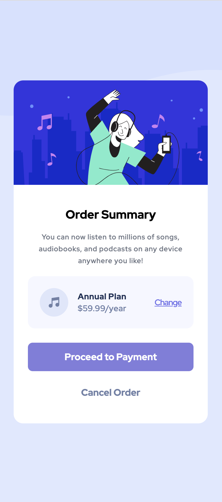

# Frontend Mentor - Order summary card solution

This is a solution to the [Order summary card challenge on Frontend Mentor](https://www.frontendmentor.io/challenges/order-summary-component-QlPmajDUj). 

Users should be able to:
- See hover states for interactive elements 
- View the optimal layout depending on their device's screen size 

## Screenshot 

## Links 

- Solution URL:(https://www.frontendmentor.io/solutions/order-summary-card-solution-2mtJBZu2bd) 
- Live Site URL:(https://bkfoe.github.io/order-summary-card-solution/)

## Author 

- Website - [BKFOE](https://github.com/BKFOE)
- Frontend Mentor - [@BKFOE](https://www.frontendmentor.io/profile/bkfoe)